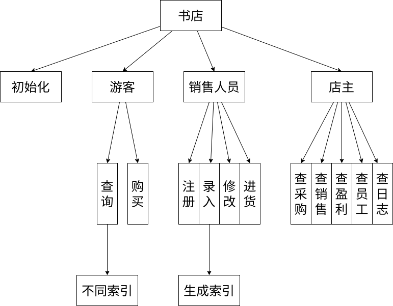

# 总体设计文档


## 功能设计
- 请概述各模块的功能和功能结构图；
### 各模块功能
- 初始化模块
- 书籍存储模块
  - 存书库
  - 存索引
- 账户存储模块
  - 存三类账户和索引
  - 操作人员账户包括销售人员操作信息
- 流水存储模块
  - 存采购
  - 存销售
  - 存盈利
  - 存日志
- 运行模块
  - 前端，与用户交互

### 功能结构图

## 用户交互设计
### 初始
```
输入：
<店主用户名>
```
### 书籍限定词
```
ISBN号：ISBN
书名：NAME
关键字：CORE
库存量：INSTORATON
单价：PRICE
以上所有：ALL
```
### 账号 
注册

```
输入：
CREATE <用户类型> <用户名>
输出：
<用户名>注册成功/<用户名>已存在
```
登入 

```
输入：
LOGIN <用户类型> <用户名>
输出：
<用户名>登录成功/<用户名>账号不存在
```
登出

```
输入：
LOGOUT
输出：
<用户名>登录成功/无登录账号
```
### 顾客

查询
```
输入：
INQUIRE 
<书籍限定词>
<信息类型> <信息>
END
输出：
清单/书籍不存在
```
购买
```
输入：
BUY <ISBN> <数量>
输出：
购买成功/书籍不存在
```
### 销售人员 
注册账号
```
输入：
CREATE <用户类型> <用户名>
输出：
<用户名>注册成功/<用户名>已存在
```
书籍信息录入
```
输入：
BOOKCREATE <书籍限定词> <限定词内容>
输出：
录入成功/书籍已存在
```
书籍信息修改
```
输入：
BOOKCHANGE <ISBN号> <被修改书籍限定词> <限定词内容>
输出：
修改成功/书籍不存在
```
进货
```
输入：
BOOKINPORT <ISBN号> <数量> <进货价格>
输出：
修改成功/书籍不存在
```
### 店主
查询某段时间的采购信息
```
输入：
BUYLIST <起始时间> <终止时间>
输出：
<ISBN号> <数量> <单价> 的表单
```
查询销售情况
```
输入：
SELLLIST <起始时间> <终止时间>
输出：
<ISBN号> <数量> <单价> 的表单
```
查询盈利信息
```
输入：
EARNLIST <起始时间> <终止时间>
输出：
<收入> <支出> <利润>
```
查看各员工的工作情况报告
```
输入：
CHECKWORKER <员工姓名> <操作类型> <起始时间> <终止时间>
输出：
<操作表单>
备注：
其中操作类型包括CREATE,BOOKCREATE,BOOKCHANGE,BOOKINPORT,ALL
```
查看系统的整体工作日志
```
输入：
SEELOG
输出：
<工作日志>
```
## 类、结构体设计
游客类
- 用户名 
- 登出函数

顾客类（派生于游客）
- 查询函数
- 购买函数

销售人员类（派生于顾客）
- 录入函数
- 修改函数
- 进货函数
- 创建账户函数
- 操作信息记录模块：
  -  时间数组
  -  对应的类型数组
  -  对应的位置数组
  -  录入数组
  -  修改数组
  -  进货数组
  -  建账户数组

店主类（派生自销售人员）
- 五种查询函数

书类
- ISBN
- 书名
- 关键字数组
- 关键字数组切片位
- 库存量
- 单价

采购类
- 操作者
- 时间
- ISBN 号
- 数量
- 单价

销售类
- 操作者
- 时间
- ISBN 号
- 数量
- 单价

盈利类
- 时间数组
- 收支数组：收入（+）/支出（-）

日志类
## 数据库设计

书房文件：存储所有书类

类似地几个序文件有：（块状链表）
- ISBN序文件：（下同理）
  - key：ISBN
  - value：在书房文件中位置
- 书名序文件 
- 作者序文件
- 关键词序文件

账号文件：
- 游客：游客用户名块状链表
- 顾客：顾客用户名块状链表
- 员工文件：存储所有员工类
- 员工序文件：块状链表

采购文件：按时间排序的所有采购类块状链表

销售文件：按时间排序的所有销售类块状链表

盈利文件：一个盈利类块状链表

整体日志文件：一个日志类


